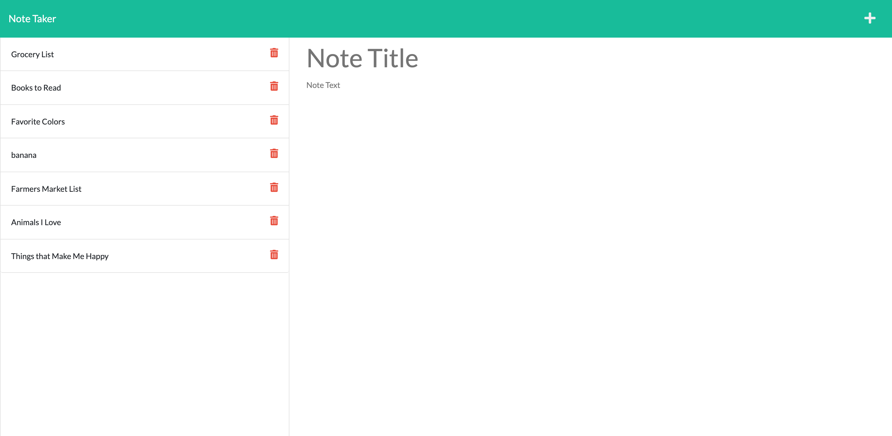

# Note Taker
This was challenge 11 of our coding bootcamp. It's a similar project to our taskinator app, but this one is using a JSON database to hold previous notes as opposed to localStorage.

## How did I build this?
This was our first full-stack project, where we used everything we have learned to build off starter code that was given to us. We used POST and GET API routes, Javascript, JSON, HTML, CSS, and Node.js to build this (I am probably forgetting something).

## What is the point of this app?
This app was designed to replace a paper notebook. The user is able to click a button on the initial landing page that takes them to the notes page. Here they're are able to add notes, view previous notes and delete notes.

## What does it look like?

## Where can I find this?
Either at the live URL (https://mmlawton15.github.io/challenge-eleven-notepad/) or at my GithHub repo (https://github.com/mmlawton15/challenge-eleven-notepad)